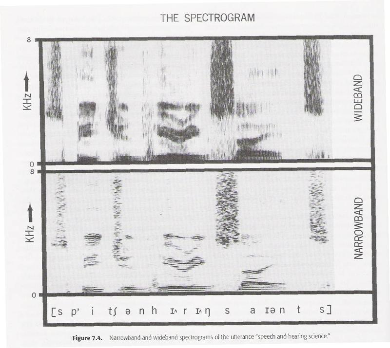

Vocal synthesizer based on a small set of average English formant data, meant for intuitive vocal and musical notation with 
simplified audio <a href="https://en.wikipedia.org/wiki/Spectrogram" target="_blank">spectrograms</a>, which are more like a <a href="https://en.wikipedia.org/wiki/Piano_roll#/media/File:Computer_music_piano_roll.png" target="_blank">piano roll</a> 
in a sequencer than the usual score sheets.

### TODO:  
- for log scale use 96-144 oscillators set over the lowest octave and only harmonics that are powers of 2, use value curve for crossfader ?  
- improve spectrogram editor with canvas, add grid with optional alignment, handle mouse velocity (https://gist.github.com/pa6lo/5070811)  
- detect hand drawn spectrograms on paper (https://docs.opencv.org/4.x/df/def/tutorial_js_meanshift.html, https://docs.opencv.org/4.x/d4/dc6/tutorial_py_template_matching.html)  
- cluster consonants by SSP over vowels 2nd formant and base pitch (stress)  
- improve phoneme representations (https://wavesurfer.xyz/examples/?vowels.js)  

